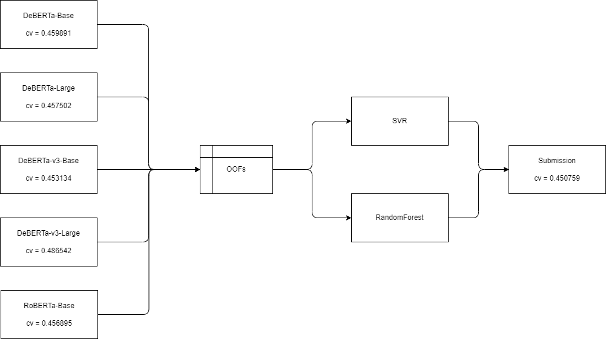

# feedback_prize_2022

## Overview

## Solution Details

### 1st Stage Model

The following models were trained by max_seq_len=256,512,768.

- deberta-base
- deberta-large
- deberta-v3-base
- deberta-v3-large
- roberta-base

### Loss Function

- HuberLoss, delta=1.0
  - Same as SmoothL1Loss

### 2nd Stage Model (Stacking)

- Join oof of 1st stage models.
- Train with SVR and RandomForest by cuml.

## Evaluation

- MultilabelStratified 4 Fold
- 3 seeds random averaging
- MCRMSE

## Not working for me

- Stacking roberta-large.
- Last 4 layer weighted averaging of transformer layers.
- Round the decimal point to several places.
